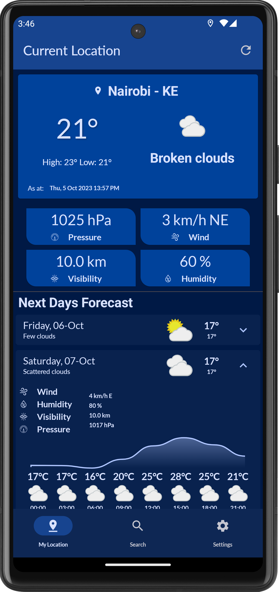
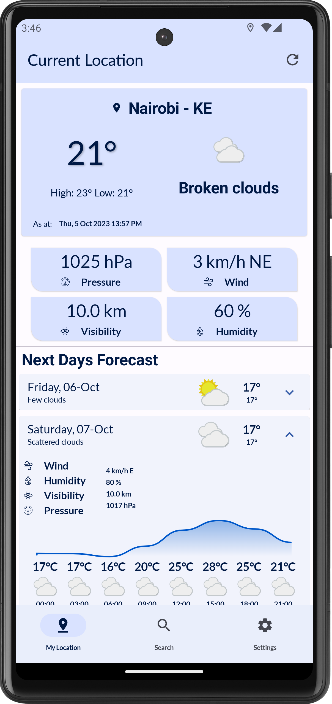
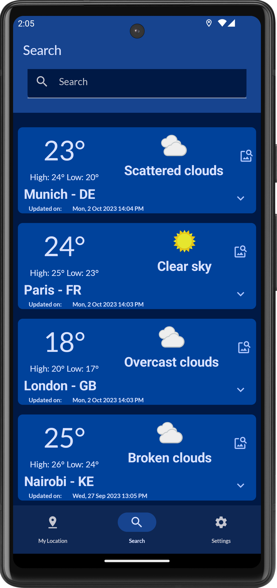
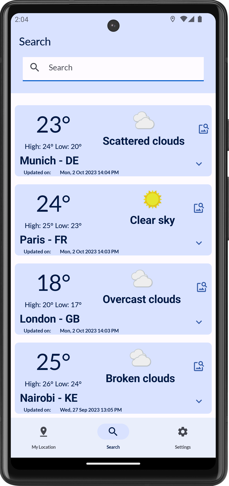

# Weather - Forecast
###### Status
[](https://app.bitrise.io/app/dc7317ba-d218-4979-b14c-a193597bd8fb)[](https://codecov.io/gh/AwesomeJim/weather-forecast)
<br/>

[](https://opensource.org/licenses/Apache-2.0) [](https://android-arsenal.com/api?level=23)
<br/>
This repository is a weather application to display the current weather ☔  at the user’s location and a
5-day forecast using the  [Open Weather API](https://openweathermap.org/api) as well as photos of a saved location from [The Flickr API](https://www.flickr.com/services/developer)

✨Application Features:
--------------
This app enable users to:
- See the weather details as well as a 5 days forecast of their current location
- Search and save locations as favorite
- View public photos of a saved location
- delete or refresh weather details of a saved location.

# [Screenshots 📱](screenshots)

|                          Home       (Dark Theme)                          |                            Home  (Light Theme)                             |
|:-------------------------------------------------------------------------:|:--------------------------------------------------------------------------:|
|  |  |

|                       Saved Locations  (Dark Theme)                        |                                (Light Theme)                                 |
|:--------------------------------------------------------------------------:|:----------------------------------------------------------------------------:|
|  |  |

 |                                 Maps                                 |
|:--------------------------------------------------------------------:|
|  |


|                                                                          Screen Recording                                                                          |
|:------------------------------------------------------------------------------------------------------------------------------------------------------------------:|
| <video src="https://github.com/AwesomeJim/weather-forecast/assets/8529047/92305f75-1de8-464e-a159-f0fec662b20e" controls="controls" width="630" height="300"></video> |


## Tech-stack used 🛠
| **Tech Tools**                                                                    | **Usage/Purpose**                                          |
|-----------------------------------------------------------------------------------|------------------------------------------------------------|
| [Kotlin](https://github.com/JetBrains/kotlin)                                     | Language                                                   |
| [Jetpack Compose](https://developer.android.com/jetpack/compose)                  | UI creation library                                        |
| [Compose Navigation](https://developer.android.com/jetpack/compose/navigation)    | Navigate between Compose Screen                            |
| [Compose Paging](https://developer.android.com/jetpack/androidx/releases/paging)  | Managing multiple pages of data                            |
| [Coil](https://coil-kt.github.io/coil/)                                           | 🖼️ Image Loading Library                                  |
| [Coroutines](https://kotlinlang.org/docs/coroutines-overview.html)                | 🧵 Asynchronous Programming                                |
| [StateFlow](https://developer.android.com/kotlin/flow/stateflow-and-sharedflow)   | Observable Data and state holder                           |
| [Dependency injection with Hilt](https://dagger.dev/hilt/)                        | 💉 Dependency Injection Library                            |
| [Retrofit](https://square.github.io/retrofit/)                                    | 🌐 Used for Networking                                     |
| [OkHTTP](https://square.github.io/okhttp/)                                        | 🌐 HTTP Client required by Retrofit Library for Networking |
| [Kotlinx Serialization](https://github.com/Kotlin/kotlinx.serialization)          | 🌐 Use to serialize and deserialize Kotlin objects to JSON |
| [Kotlin Gradle](https://kotlinlang.org/docs/gradle-configure-project.html)        | ⚙️ All the gradle files are written in pure kotlin         |
| [AndroidX](https://developer.android.com/jetpack/androidx)                        | Android library for core functionalities                   |
| [ViewModel](https://developer.android.com/topic/libraries/architecture/viewmodel) | Manage data and UI State in lifecycle-aware fashion        |
| [Room DB](https://developer.android.com/topic/libraries/architecture/room)        | 💾  For local data storage                                 |
 | [android-maps-compose ](https://github.com/googlemaps/android-maps-compose)       | Show saved locations on the Map                            |

_**Testing**_ <br/>

| **Testing Tools**                             | **Usage/Purpose** |
|-----------------------------------------------|-------------------|
| [Junit](https://junit.org/junit4/)            | Unit Testing      |
| [Mockk](https://mockk.io/)                    | Data Mocking      |
| [Truth](https://truth.dev/)                   | Unit Testing      |
| [Turbine](https://github.com/cashapp/turbine) | Flow Testing      |


_Other Tools/Project setup_ <br/>

| **Tools**                                                                            | **Usage/Purpose**                                                                      |
|--------------------------------------------------------------------------------------|----------------------------------------------------------------------------------------|
| [Gradle secrets plugin](https://github.com/google/secrets-gradle-plugin)             | A Gradle plugin for providing your secrets to your Android project                     |
| [Hilt(DI)](https://developer.android.com/training/dependency-injection/hilt-android) | Dependency Injection Library                                                           |
| [Kotlin Symbol Processing (KSP)](https://developer.android.com/build/migrate-to-ksp) | code generation  for Room and Hilt libraries                                           |
| [Timber](https://github.com/JakeWharton/timber)                                      | For local Logging                                                                      |
| [Lottie Compose](https://github.com/airbnb/lottie/blob/master/android-compose.md)    | Icon and images animations                                                             |
| [Gradle version catalogs](https://docs.gradle.org/current/userguide/platforms.html)  | Gradle Dependencies management                                                         |
| [Spotless](https://github.com/diffplug/spotless)                                     | For Code formatting [check how to setup](https://funkymuse.dev/posts/spotless-ktlint/) |

_Other Tools_ <br/>

| **Workflow Tools**                                                           | **Usage/Purpose**                                                                   |
|------------------------------------------------------------------------------|-------------------------------------------------------------------------------------|
| [Bitrise](https://bitrise.io/integrations/steps)                             | For CI/CD                                                                           |
| [Fastlane](https://docs.fastlane.tools/getting-started/android/screenshots/) | Local gradle tasks automation                                                       |
| [jacoco](https://github.com/jacoco/jacoco)                                   | For code coverage reporting generation                                              |
| [codecov](https://about.codecov.io/)                                         | Code coverage reporting - Get Code Coverage Insights Directly in the CI/CD Workflow |

## [🏗️ Architecture Diagram](https://github.com/AwesomeJim/weather-forecast/)

This App is based on the MVVM architecture and the Repository pattern, which follows the [Google's official architecture guidance](https://developer.android.com/topic/architecture).<br/>
  <br/>
* Each layer follows [unidirectional event/data flow](https://developer.android.com/topic/architecture/ui-layer#udf); the UI layer emits user events to the data layer, and the data layer exposes data as a stream to other layers.
* The data layer is designed to work independently of other layers and must be pure, which means it doesn't have any dependencies on the other layers.

With this loosely coupled architecture, it increases the usability of components and scalability of the app

---
## Development Setup ⚙️ and Pre-requisite 📝
**The Project uses 2 api :**
1. [OpenWeather API 🔑](https://openweathermap.org/current) for Weather Data and.
2. [The Flickr API 🔑](https://www.flickr.com/services/developer) to fetch paginated photos of a give location
3. [Google Maps API key 🔑](https://developers.google.com/maps/documentation/android-sdk/get-api-key)

#### _⚙️ Setup Weather Data API_

 <br/>
This project fetches weather data from the [OpenWeather API](https://openweathermap.org/current).  
To begin the setup, you'll need to create an account and get a free API key.
1. Create an account at [openweathermap.org](https://home.openweathermap.org/api_keys)
2. Go to settings from the profile icon
3. Click on API
4. Click on Create

#### _⚙️ Setup Location Public Photos Data API_
This project fetches photos data from  [The Flickr API](https://www.flickr.com/services/developer).  
To begin the setup, you'll need to create an account and get a free API key.
How to create your Flickr API keys, go to [Flickr](https://www.flickr.com/services/api/)
1. Create an Application - You will first need to create an application. Click on “create your first”. 
2. Request an API Key - Then, make a request for an API key by clicking on “Request an API Key - [check this guide with visuals](https://www.appypie.com/faqs/how-to-create-a-flickr-api-key)<br/>

#### _⚙️ Setup Google Maps API key 🔑_
1. Get a [Maps API key](https://developers.google.com/maps/documentation/android-sdk/get-api-key)

in your `local.properties` you will need to add your API keys and copy the urls for the two apis

```
#Insert at ~/local.properties

#OPEN_WEATHER
OPEN_WEATHER_APP_ID = <insert your OperWeather API Key>
OPEN_WEATHER_BASE_URL= https://api.openweathermap.org/
OPEN_WEATHER_ICONS_URL= http://openweathermap.org/img/wn/

#Fliker
FLICKR_PHOTOS_BASE_URL = https://www.flickr.com/services/rest/
FLICKR_API_KEY = <insert your Flickr API Key>

#Maps API Key
MAPS_API_KEY = <insert YOUR Maps >
```

This project uses the Hilt for dependency Injection. After opening this project in your Android Studio you might get some error which is due unavailability of a few classes. You need to `make a project` or try to build the project, this will generate all the required classes for Hilt.

*Environment*
- Android Studio Giraffe | 2022.3.1 Patch 1
- JDK 17


# Sample Apk


---
[License](https://github.com/AwesomeJim/weather-forecast/blob/main/LICENSE)
-------

    Weather - ForecastApp
    Copyright (c) 2023 Awesome Jim (https://github.com/AwesomeJim/weather-forecast/). 

     This App is distributed under the terms of the Apache License (Version 2.0). 
     See the [license](https://github.com/AwesomeJim/weather-forecast/blob/main/LICENSE) for more information.
